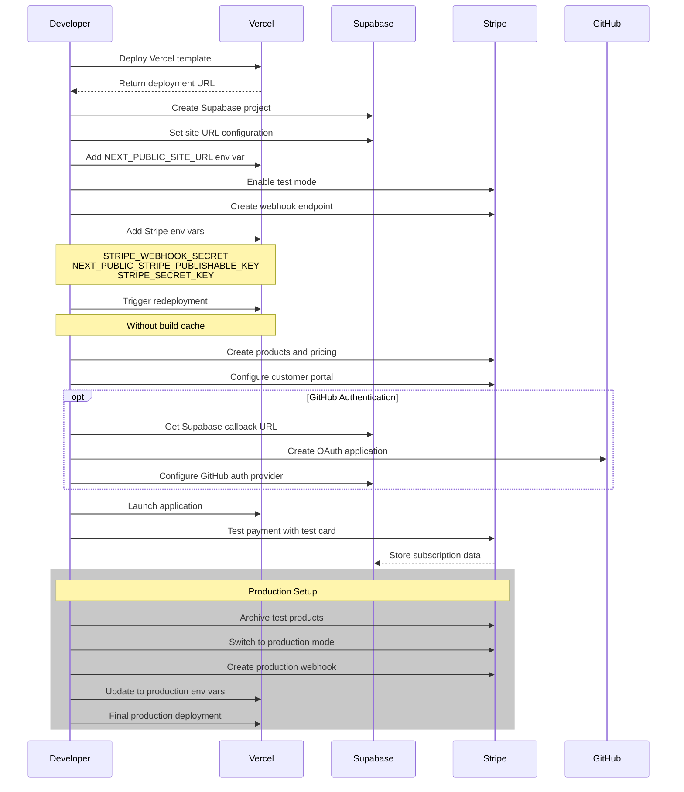

# Migrate from ViteJS to NextJS

## Why migrate from ViteJS to NextJS

The simple answer is support **full stack framework in the future**, means we can use the same framework to build the website and the backend service.

More generally, the choice between Vite.js and Next.js depends on your specific project requirements:

- If you're focusing solely on frontend development and prioritize speed and flexibility in choosing frontend frameworks, Vite.js might be more suitable.
- If you're building a full-stack application, especially one that requires server-side rendering, SEO optimization, and integrated backend functionality, Next.js would be a more appropriate choice. 

Detailed comparison are listed below:
- Targeted Audience:
Vite.js does not provide built-in backend capabilities and is primarily focused on frontend development. For backend functionality, you would need to use a separate backend solution
Next.js offers API routes, allowing you to build backend functionality directly within your Next.js application, making it suitable for full-stack development.

- Development Speed:
Vite.js is known for its extremely fast development server and build times, which can significantly speed up the development process for frontend applications. 
Next.js, while also performant, may have slightly longer build times due to its additional features like SSR and SSG.

- Learning Curve:
Vite.js was purely a frontend framework, it has a relatively low learning curve, especially for developers already familiar with modern JavaScript frameworks. 
Next.js was React specific framework, it has a steeper learning curve due to its full-stack nature and additional features, but it provides more out-of-the-box functionality.

- Flexibility:
Vite.js is more flexible in terms of frontend framework choice, supporting multiple frameworks, e.g. React, Vue, etc.
Next.js is specifically designed for React applications, offering deep integration with the React ecosystem, with features like SSR and SSG.
Backend Capabilities:

- Deployment:
Vite.js projects are typically deployed as static sites or SPAs, requiring a separate backend service if needed. [2]
Next.js applications can be easily deployed to various platforms with built-in support for serverless functions and edge computing.

## How to migrate

There are full diff files below for your reference which contains the changes between the ViteJS and NextJS, you can check the details in this [PR](https://github.com/yike5460/intelli-ops/pull/31)

```
Changes not staged for commit:
  (use "git add/rm <file>..." to update what will be committed)
  (use "git restore <file>..." to discard changes in working directory)
        modified:   web/.gitignore
        deleted:    web/index.html
        modified:   web/package-lock.json
        modified:   web/package.json
        deleted:    web/src/App.jsx
        deleted:    web/src/components/CopyableCommand.jsx
        deleted:    web/src/components/FAQ.jsx
        deleted:    web/src/components/Features.jsx
        deleted:    web/src/components/Footer.jsx
        deleted:    web/src/components/Header.jsx
        deleted:    web/src/components/Hero.jsx
        deleted:    web/src/components/Pricing.jsx
        deleted:    web/src/components/QuickStart.jsx
        deleted:    web/src/index.js
        deleted:    web/src/index.jsx
        deleted:    web/src/main.jsx
        deleted:    web/vite.config.js

Untracked files:
  (use "git add <file>..." to include in what will be committed)
        web/.next/
        web/README.md
        web/components/
        web/next-env.d.ts
        web/next.config.js
        web/pages/
        web/postcss.config.js
        web/styles/
        web/tailwind.config.js
        web/tsconfig.json
```

Note the configuration in Vercel hosting platform also needed to be updated in "Settings" -> "Build & Development Settings" -> "Environment Variables"

## Multiplex the website to GitHub Pages

We are multiplexing the same code base in folder web to two different destinations:
- GitHub Pages: using GitHub Actions to deploy the website to GitHub Pages. The workflow file is defined in `.github/workflows/github-pages.yml`, note to add create GitHub page in the repository settings and set gh-pages as the source branch.
- Vercel: using Vercel to host the website. The configuration is in `vercel.json`.

Note we add `.vercelignore` to configure Vercel to ignore the gh-pages branch entirely. thus avoid unnecessary build in Vercel, or add the following command in Vercel project settings -> "Git" -> "Ignored Build Step" -> "Custom":
```
if [ "$VERCEL_GIT_COMMIT_REF" = "gh-pages" ]; then echo "Skipping deploy for gh-pages branch"; exit 0; else exit 1; fi
```

# Build payment page

Follow the guidance in [Stripe React](https://github.com/yike5460/nextjs-subscription-payments) to build the payment page.

Overview of the building process:


The brief steps are:
1. [Vercel] Deploy the sample [Vercel template](https://vercel.com/new/clone?repository-url=https%3A%2F%2Fgithub.com%2Fvercel%2Fnextjs-subscription-payments&env=NEXT_PUBLIC_STRIPE_PUBLISHABLE_KEY,STRIPE_SECRET_KEY&envDescription=Enter%20your%20Stripe%20API%20keys.&envLink=https%3A%2F%2Fdashboard.stripe.com%2Fapikeys&project-name=nextjs-subscription-payments&repository-name=nextjs-subscription-payments&integration-ids=oac_VqOgBHqhEoFTPzGkPd7L0iH6&external-id=https%3A%2F%2Fgithub.com%2Fvercel%2Fnextjs-subscription-payments%2Ftree%2Fmain), record the link (e.g. https://your-deployment-url.vercel.app)
2. [Supabase] Create a Supabase project and set your main production URL (e.g. https://your-deployment-url.vercel.app) as the site url.
3. [Vercel] Go to Vercel deployment settings, add a new Production environment variable called NEXT_PUBLIC_SITE_URL and set it to the same URL.
4. [Stripe] Configure [Stripe](https://stripe.com/) to handle test payments, make sure the ["Test Mode"](https://stripe.com/docs/testing) toggle switched on.
5. [Stripe] Go to [Stripe Developers](https://dashboard.stripe.com/developers) with operations below:
  - Click the "Add Endpoint" button on the test Endpoints page.
  - Enter your production deployment URL followed by /api/webhooks for the endpoint URL. (e.g. https://your-deployment-url.vercel.app/api/webhooks)
  - Click Select events under the Select events to listen to heading.
  - Click Select all events in the Select events to send section.
  - Copy Signing secret as we'll need that in the next step (e.g whsec_xxx) (/!\ be careful not to copy the webook id we_xxxx).
  - In addition to the NEXT_PUBLIC_STRIPE_PUBLISHABLE_KEY and the STRIPE_SECRET_KEY we've set earlier during deployment, we need to add the webhook secret as STRIPE_WEBHOOK_SECRET env var.
6. [Vercel] Go to Vercel Dashboard, navigate to deployments, click the overflow menu button and select "Redeploy" (do NOT enable the "Use existing Build Cache" option)
7. [Stripe] Create your product and pricing information in the [Stripe Products](https://dashboard.stripe.com/test/products), configure the customer portal in the [Stripe Billing Portal](https://dashboard.stripe.com/test/settings/billing/portal)
8. [GitHub & Supabase, optional] Go to Supabase Dashboard > Project Settings > Auth > Providers > GitHub, record the Callback URL (for OAuth), e.g. https://[PROJECT_REF].supabase.co/auth/v1/callback, then go to GitHub Settings > Developer Settings > OAuth Apps > New OAuth App, fill in the application details and record the Client ID and Client Secret:
  - Application name: Your app name
  - Homepage URL: Your app URL (e.g., https://your-deployment-url.vercel.app)
  - Authorization callback URL: Your Supabase auth callback URL (https://[PROJECT_REF].supabase.co/auth/v1/callback)
Then go back to Supabase Dashboard > Project > Auth > Providers > GitHub (https://supabase.com/dashboard/project/[PROJECT_REF]/auth/providers), click "Update" to save the changes.
9. [Vercel] Launch the application, you should be able to see the payment page, refer to the [Stripe Testing Card Numbers](https://docs.stripe.com/testing?testing-method=card-numbers#testing-interactively) and complete the purchase to verify the payment works, you should see the subscription details in the Supabase Database (https://supabase.com/dashboard/project/[PROJECT_REF]/auth/users).
**Please Note:**
The user registration by email & password is limited to the same email domain of the one used in the Supabase project's organization due to the email abuse prevention, refer to the [Supabase Offical Notice](https://github.com/orgs/supabase/discussions/29370) for more details.